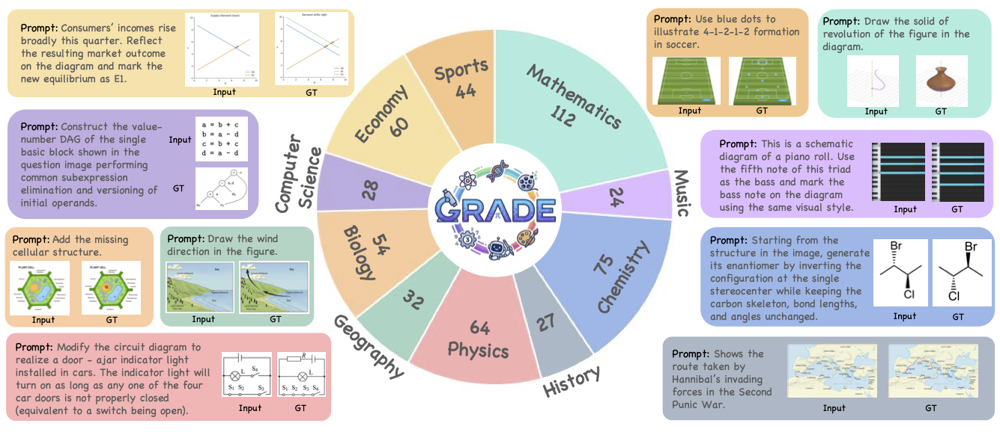
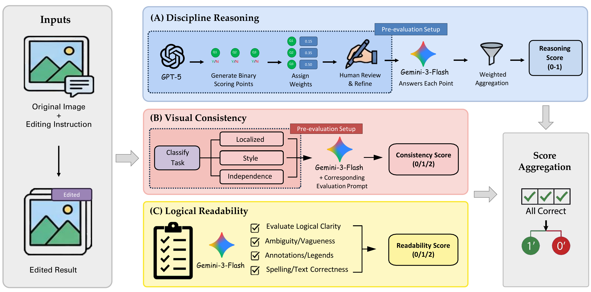
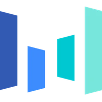

<p align="center">
  
  
  
</p>

<h1 align="center">  GRADE: <b>G</b>rounded <b>R</b>easoning <b>A</b>ssessment for <b>D</b>iscipline-informed <b>E</b>diting </h1>

<p align="center">
  <b>
    Mingxin Liu<sup>1,*</sup>, Ziqian Fan<sup>2,*</sup>, Zhaokai Wang<sup>1,*</sup>,
    Leyao Gu<sup>1,*</sup>, Zirun Zhu<sup>1,*</sup>, Yiguo He<sup>1</sup>,
    Yuchen Yang<sup>3</sup>, Changyao Tian<sup>4</sup>, Xiangyu Zhao<sup>1</sup>,
    Ning Liao<sup>1</sup>, Shaofeng Zhang<sup>5</sup>, Qibing Ren<sup>1</sup>,
    Zhihang Zhong<sup>1</sup>, Xuanhe Zhou<sup>1</sup>, Junchi Yan<sup>1</sup>,
    Xue Yang<sup>1,†</sup>
  </b>
</p>

<p align="center">
  <sup>1</sup> Shanghai Jiao Tong University &nbsp;&nbsp;
  <sup>2</sup> South China University of Technology &nbsp;&nbsp;
  <sup>3</sup> Fudan University <br>
  <sup>4</sup> The Chinese University of Hong Kong &nbsp;&nbsp;
  <sup>5</sup> University of Science and Technology of China
</p>

<p align="center">
  <sup>*</sup> Equal Contribution &nbsp;&nbsp;
  <sup>†</sup> Corresponding Author
</p>


<p align="center">
<a href='https://arxiv.org/abs/2603.12264'>
    
  </a>
  <a href='https://huggingface.co/datasets/VisionXLab/GRADE'>
    
  </a>
  <a href='https://grade-bench.github.io/'>
    
  </a>
</p>

<p align="center">
  
</p>

## 🧠 Introduction

GRADE is the first benchmark for evaluating discipline-informed knowledge and reasoning in image editing. It comprises 520 carefully curated samples across 10 academic domains — from natural science to social science — and provides a multi-dimensional automated evaluation protocol that jointly assesses <b>Discipline Reasoning</b>, <b>Visual Consistency</b>, and <b>Logical Readability</b>.

<p align="center">
  
</p>


---


## 🔥 Leaderboard
<div align="center">

| Model | Reasoning | Consistency | Readability | Accuracy |
|-------|:---------:|:-----------:|:-----------:|:--------:|
| **Closed Source Models** | | | | |
|  Nano Banana Pro | **77.5** | **89.5** | 95.8 | **46.2** |
|  Nano Banana 2 | 72.6 | 86.4 | **95.9** | 39.6 |
|  Seedream 5.0 | 64.1 | 87.5 | 90.6 | 24.7 |
|  GPT-Image-1.5 | 54.5 | 82.3 | 90.7 | 16.0 |
|  FLUX.2 Max | 47.8 | 67.2 | 68.6 | 11.9 |
|  Nano Banana | 42.2 | 75.1 | 82.0 | 9.0 |
|  Seedream 4.5 | 41.3 | 55.6 | 82.1 | 6.9 |
|  GPT-Image-1.0 | 44.0 | 65.2 | 82.3 | 6.0 |
|  FLUX.2 Pro | 38.9 | 55.5 | 70.3 | 4.4 |
|  Seedream 4.0 | 32.4 | 53.2 | 77.0 | 3.1 |
| **Open Source Models** | | | | |
|  Qwen-Edit-2511 | 18.6 | 45.2 | 52.1 | 2.7 |
|  Step-1x (think+reflect) | 19.2 | 57.2 | 66.9 | 2.3 |
|  Step-1x (think) | 17.6 | 56.3 | 68.2 | 1.4 |
|  DreamOmni | 17.4 | 83.2 | 89.1 | 1.0 |
|  Step-1x | 17.3 | 52.8 | 63.7 | 1.0 |
|  Bagel | 15.2 | 58.6 | 69.8 | 0.6 |
|  Bagel (think) | 15.6 | 54.8 | 67.8 | 0.2 |
|  ICEdit | 9.8 | 33.2 | 56.5 | 0.2 |
|  FLUX.2 dev | 11.3 | 17.6 | 49.6 | 0.2 |
|  OmniGen | 9.7 | 33.6 | 51.6 | 0.0 |

</div>

---

## 🎯 Quick Start

**1. Install dependencies**

```bash
pip install openai simplejson tqdm
```

**2. Prepare the dataset**

Download from [Hugging Face](https://huggingface.co/datasets/VisionXLab/GRADE)

`data.json` is the core file that stores all metadata for evaluation.  
Before running evaluation, please organize the `result.json` in the following format:

```jsonc
[
  {
    "image_path":   "path/to/original.png", // Input image
    "editing_path": "path/to/edited.png",  // Model result 
    "gt":           "path/to/ground_truth.png", //GT
    "text":         "Shift the AD curve to the right",  //Editing prompt
    "task_id":      "eco_macro_001",
    "consistency":  "overall",          // "overall" | "style" | "none"
    "sub_task":     "Macroeconomics",
    "questions": [
      { "id": "Q1", "question": "Is the AD curve shifted right?", "score": 0.5 },
      { "id": "Q2", "question": "Is the new equilibrium labeled?",  "score": 0.5 }
    ]
  }
]
```


**3. Configure & Run**

Please configure `eval.py` as follows:

```python
data_json = "/path/to/your/result.json"   # path to the model's result.json
BASE_URL  = "https://your-api-endpoint"    # OpenAI-compatible API endpoint
API_KEY   = "your-api-key"
WORKERS   = 20
```

Then run the following command to start evaluation:

```bash
python eval.py
```

**4. Obtain the Final Score**

All outputs are written to the same directory as `result.json`:

```
your_model_dir/
├── result.json                      # Input data
├── gemini_flash_eval_1.json         # Merged Discipline Reasoning results
├── gemini_flash_consis_4.json       # Merged Visual Consistency results
├── gemini_flash_read_4.json         # Merged Logical Readability results
├── full_result_gemini_flash.json    # Complete per-task breakdown
└── domain_score.json                # Final Accuracy & Relax Score by domain
```

**5. Resumability**

Each evaluation stage checks for existing result files before processing. If a run is interrupted, simply re-run `python eval.py` — completed tasks will be skipped automatically.

---

## Citation

```bibtex
@misc{liu2026gradebenchmarkingdisciplineinformedreasoning,
      title={GRADE: Benchmarking Discipline-Informed Reasoning in Image Editing}, 
      author={Mingxin Liu and Ziqian Fan and Zhaokai Wang and Leyao Gu and Zirun Zhu and Yiguo He and Yuchen Yang and Changyao Tian and Xiangyu Zhao and Ning Liao and Shaofeng Zhang and Qibing Ren and Zhihang Zhong and Xuanhe Zhou and Junchi Yan and Xue Yang},
      year={2026},
      eprint={2603.12264},
      archivePrefix={arXiv},
      primaryClass={cs.CV},
      url={https://arxiv.org/abs/2603.12264}, 
}
```


